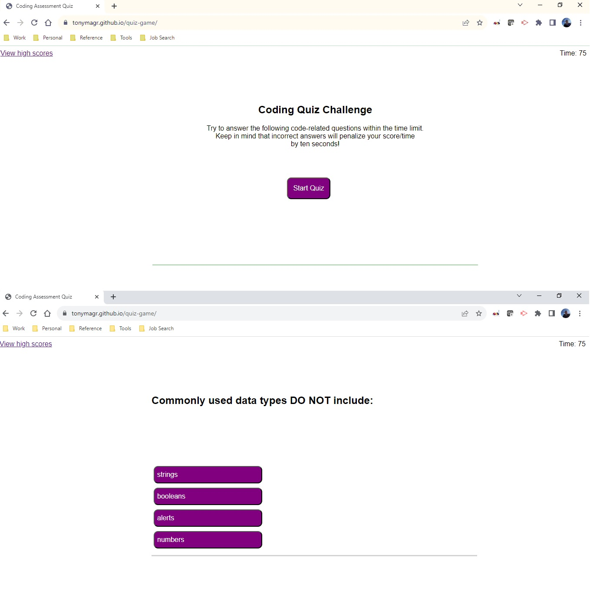

# Coding Assessment Quiz - Tony Magrady

## README Author
Tony Magrady - Berkeley Full-Stack Web Development Bootcamp student  
-- September 5, 2023

## Description
Coding Assessment Quiz Game website for new web front-end developers, including HTML, CSS, and Javascript.Link to page: https://tonymagr.github.io/quiz-game/

Javascript skills I learned while creating this website were:
- Window and DOM basics
- Modifying HTML elements via JS
- Styling HTML elements via JS
- Creating HTML elements via JS
- Intervals
- Event listeners
- Data attributes
- Local storage

## Website Image

## Challenges
Formatting the newly created website via CSS and Javascript can situationally pose challenges.  
Creating child elements that are dynamic buttons and referencing the buttons in parent elements posed  
a few design and logic challenges. 
Managing all storage features was new and required some learning.

## Installation
N/A

## Usage
New web front-end developers can use this quiz game tool to sharpen their HTML, CSS, and Javascript skills.

## Credits
Logic to sort descending an array of objects (in this case, stored high scores) was from:  
https://stackoverflow.com/questions/1129216/sort-array-of-objects-by-string-property-value

## License
MIT License

Copyright (c) 2023 Tony Magrady

Permission is hereby granted, free of charge, to any person obtaining a copy
of this software and associated documentation files (the "Software"), to deal
in the Software without restriction, including without limitation the rights
to use, copy, modify, merge, publish, distribute, sublicense, and/or sell
copies of the Software, and to permit persons to whom the Software is
furnished to do so, subject to the following conditions:

The above copyright notice and this permission notice shall be included in all
copies or substantial portions of the Software.

THE SOFTWARE IS PROVIDED "AS IS", WITHOUT WARRANTY OF ANY KIND, EXPRESS OR
IMPLIED, INCLUDING BUT NOT LIMITED TO THE WARRANTIES OF MERCHANTABILITY,
FITNESS FOR A PARTICULAR PURPOSE AND NONINFRINGEMENT. IN NO EVENT SHALL THE
AUTHORS OR COPYRIGHT HOLDERS BE LIABLE FOR ANY CLAIM, DAMAGES OR OTHER
LIABILITY, WHETHER IN AN ACTION OF CONTRACT, TORT OR OTHERWISE, ARISING FROM,
OUT OF OR IN CONNECTION WITH THE SOFTWARE OR THE USE OR OTHER DEALINGS IN THE
SOFTWARE.

---